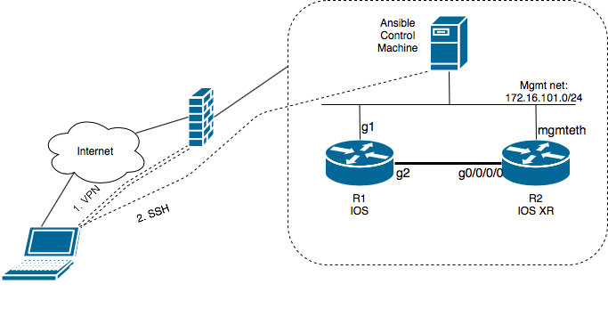
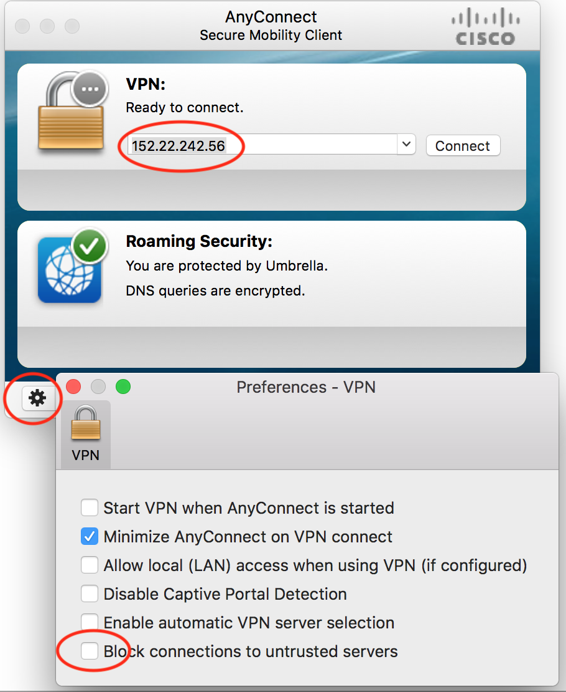

# Lab access

## Objective
- Understand lab topology
- SSH into your Ansible controller

## Lab excercise

### Lab topology


### Lab info
- Get the following info from your proctor
	- VPN server IP address
	- VPN server credentials
	- Ansible controller IP address
	- R1 IOS router IP address
	- R2 XR rotuer IP address
	- Your lab devices credentials
- Important: **Verify** your lab device IP addresses before proceeding

### VPN connect

- Use Cisco-Anyconnect client to VPN-into the lab
	- type in lab VPN server IP address
	- Click on settings-wheel and uncheck "block connections to untrusted servers"
	- Use VPN credentials provided by the proctor
	- Verify (from your laptop exec prompt):

```
ping 172.16.101.93
```

- Proceed if ping succeeds.

### SSH into your Ansible server
- SSH into your Ansible server using any SSH client
	- IP address and credentials of your pod is at: https://github.com/gnaganab/Ansible_Lab/blob/master/pod-assignment.md
	- Your pod number is written on a post-it sticker, pasted to your monitor.
	- Make absolutely sure that you use the right IP addresses.

### Verification
- Execute the below from your Ansible Controller $ prompt

```
$ ifconfig eth0

$ ping IP-of-your-IOS-router

$ ping IP-of-your-XR-router
```

- **Make sure:**
	- Eth0 IP address matches with **your assigned controller IP**
	- Ping to both IOS and XR routers succeed

### Example output
- This example output is provided for reference, to be used as needed.
- Do not read this if the steps are executed successfully.

```
GNAGANAB-M-J0A4:~ gnaganab$ ping 172.16.101.93 -c 1
PING 172.16.101.93 (172.16.101.93): 56 data bytes
64 bytes from 172.16.101.93: icmp_seq=0 ttl=63 time=34.493 ms

--- 172.16.101.93 ping statistics ---
1 packets transmitted, 1 packets received, 0.0% packet loss
round-trip min/avg/max/stddev = 34.493/34.493/34.493/0.000 ms
GNAGANAB-M-J0A4:~ gnaganab$
GNAGANAB-M-J0A4:~ gnaganab$ ssh cisco@172.16.101.93
cisco@172.16.101.93's password:
Welcome to Ubuntu 14.04.5 LTS (GNU/Linux 3.13.0-119-generic x86_64)
:
cisco@ansible-controller:~$
cisco@ansible-controller:~$ ifconfig eth0
eth0      Link encap:Ethernet  HWaddr 5e:00:00:00:00:00
          inet addr:172.16.101.93  Bcast:172.16.101.255  Mask:255.255.255.0			<<<
          inet6 addr: fe80::5c00:ff:fe00:0/64 Scope:Link
:
cisco@ansible-controller:~$ ping 172.16.101.91
PING 172.16.101.91 (172.16.101.91) 56(84) bytes of data.
64 bytes from 172.16.101.91: icmp_seq=1 ttl=255 time=0.914 ms
:
--- 172.16.101.91 ping statistics ---
2 packets transmitted, 2 received, 0% packet loss, time 1001ms
rtt min/avg/max/mdev = 0.893/0.903/0.914/0.031 ms
cisco@ansible-controller:~$ ping 172.16.101.92
PING 172.16.101.92 (172.16.101.92) 56(84) bytes of data.
64 bytes from 172.16.101.92: icmp_seq=1 ttl=255 time=1.17 ms
:
```

- Review the section and discuss if you have any questions.

---
